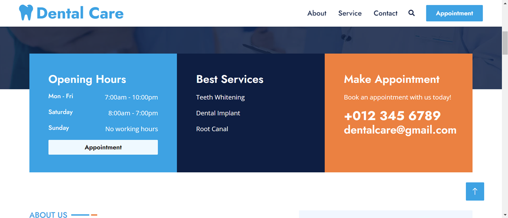
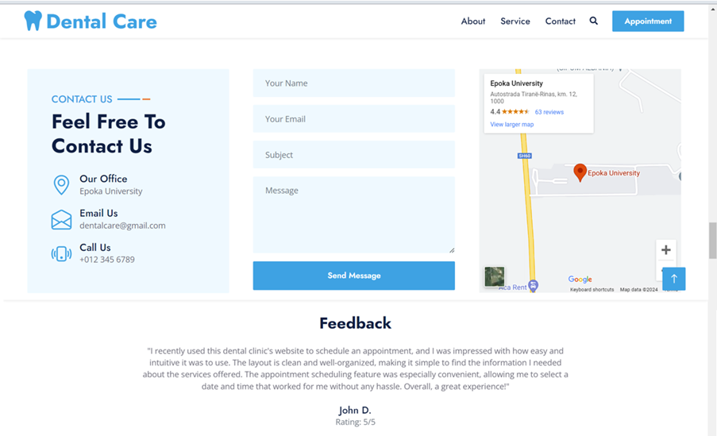
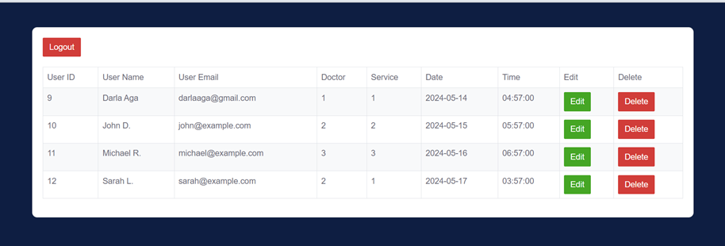

# CREATING AND IMPLEMENTING A DENTAL CLINIC SOFTWARE SYSTEM (DCSS)

# Introduction
The Project that aims to create a comprehensive web-based program that gives users a seamless way to access dental services while also giving clinic employees effective management capabilities. 

The DCSS will incorporate interactive elements for appointment scheduling, service descriptions, and patient resources, utilizing HTML, CSS, JavaScript, and PHP to ensure a user-friendly experience on devices. Through the integration of these features, the website will function as an all-inclusive online portal that facilitates patients' convenient access to vital information. 

# Objectives 

By offering an integrated platform for managing and supervising customer data, providing information about doctors and services, and developing a specific website for administrators, the DCSS project software seeks to increase client satisfaction and involvement. The program is made to be accessible from a laptop or tablet with an internet connection and has an admin page and home page that are simple to use.

# Product Functions

The software will include an online appointment scheduling system to streamline the process, reducing wait times and enhancing convenience for patients, comprehensive service information, which will provide detailed and accessible information about various dental services, doctors, treatments, and procedures offered by the clinic, a feedback page, where the clients can rate and write comments about the services offered, and finally security measures to protect patient data from unauthorized access.

# User Classes and Characteristics

The DCSS software is made to meet the requirements of various user types, each with unique requirements and traits. 
* The main users, who are patients, value an easy browsing experience and convenient access to appointment scheduling and informative resources. 
* Administrative staff members prioritize efficient tools for managing appointments and patient records, requiring streamlined workflows and system reliability. 
* Doctors, the healthcare professionals, rely on access to patient information to provide personalized care, while website visitors seek easily accessible information about services and facilities. 
* System administrators oversee the technical aspects of the application, requiring strong infrastructure and security measures to ensure smooth operation.

# Operating Environment
HTML:
* Provides organization and content.
* Used for pages like patient resources, appointment scheduling, service descriptions, and contact details.

CSS:
* Enhances visual display and styling.
* Modifies appearance of text, photos, buttons, etc.
* Establishes fonts, colors, layouts, spacing, and responsive design.

JavaScript:
* Enhances functionality for dynamic features and user interaction.
* Adds client-side capabilities (e.g., dropdown menus, appointment scheduling forms, slideshow galleries).

PHP:
* Facilitates MySQL database communication.
* Enables data transmission between website and database.
* Allows users to schedule appointments and administrators to view/modify details.

# User Requirements
The dental clinic website's user requirements comprise a number of essential features that respond to various audiences. Having these elements is essential to giving patients, staff members, medical professionals, and website visitors a smooth experience. To be exact, the website must include: 

Homepage
* Introduction to the website.
* Highlights and summary of clinic offerings.
* Navigation options for other sections.

Doctors page
* Photo about medical staff.
* Helps patients make informed decisions.

Services Page
* Information on the clinic's services.
* Includes pricing.

Appointment Page
* Patients can choose doctor, service, date, and time.
* Secure entry of contact details.
* Simplifies and quickens appointment booking.

Admin Page
* Secure access for administrative staff.
* Manage appointments.
* Ensures data security.

# Software Connections

In order to link the database and the webpage for this project, HTML and PHP will be used to develop the DCSS software according to the following criteria:

* Website Structure: PHP and HTML will be used in the creation of the software's user interface to offer the webpages' structure and layout. 

* Data processing: MySQL and PHP, will be used to manage the software's dynamic features. They are in charge of handling user input processing, establishing a connection to the database, and carrying out any required database activities.

* Database Connectivity: Using MySQL and the required credentials (password and username) for the admin's page, PHP will connect to the system's database. PHP will be able to communicate with the database using this connection and carry out operations like obtaining and inserting data.

# External Interface
When you use the DCSS software as a patient for the first time, the default view is displayed on the index.php page.

The name of the dental clinic is shown clearly along with the contact information and operating hours as soon as users open the website. The site's design, which is dominated by blue and white tones that stand for professionalism and cleanliness, creates an inviting and hygienic atmosphere. Visitors are welcomed to explore the dedication to offering the highest level of dental care, accompanied by an attention-grabbing headline that reads, "Take the Best Quality Dental Treatment."

The default view of the website contains the first part where the opening hours and best services are displayed, also the contact details, including a phone number (+012 345 6789) and email (dentalcare@gmail.com).

The next part of the website showcases a simple part of “About Us” content, where the users read the clinic’s slogan “Smile Brighter, Live Better!” and a few informative words about the clinic.

The most important part of the website is Appointment. The user finds himself in the appointment page, where he could put his information, including his name, email, and the desired service, doctor, time and date.

The next part of the home page is Pricing. Here, the user can take a look at the prices of the best services at the clinic, by pressing one of the buttons on the side to move the figures.

The website showcases a special offer on this part, where, if the user decides to book an appointment, as a first-time client he can save up to 30% on his checkup.

In the last part of the website, the user is able to send a message as desired to the clinic, by writing down his name, email, subject and message. The location, email, and phone number are also added in this part. Additionally, below he can take a look at the feedback that is given from other clients, in a rotating manner. 

When you use the DCSS program as an administrator for the first time, the logged-in view is displayed on the login.php page.

Here, the admin is required to put the correct username and password, in order to continue. For simplicity, both the username and password are “admin”.

After the administrator is logged in, he could either just take a look at the patient’s information, or edit / delete them. It is displayed the name, email, doctor, service and time for the admin.

In the example provided below, we are changing the name of the contact, from “Darla Aga”, to “Darla A.”.

# Database
PHPMyAdmin provides a user-friendly interface for managing many parts of database management when administering a database. Sensitive patient data, including contact information, must be handled securely in a clinic setting. 

Clinic administrators only have limited access to this data in order to protect patient privacy and confidentiality. For this reason, the separate login system with the 'login.php' page is put into place, as we previously discussed. Authorized staff can view patient contact information securely using this page, which serves as a secure gateway that prevents access to the information through PHPMyAdmin. 

By using this strategy, the clinic may reduce the possibility of unwanted access by strictly limiting who has access to important information. Additionally, by taking this precaution, the security of patient data is maintained while PHPMyAdmin continues to be an adaptable tool for managing many areas of the database, including information relevant to other businesses. 

# Software Testing

I have selected the Appointment class found in the appointments.php file as the testing component. The functionality for scheduling appointments in the dental clinic system is contained in this class. It is essential that this component is tested for the following reasons:

* Role: Appointment data editing, deletion, and retrieval from the database are managed by the Appointment class. Since appointments are a fundamental component of the DCSS, their accuracy is essential to the system's general operation.
* Effect on the Structure: Inadequate appointment management may result in lost data, difficulties with scheduling, or problems with patient care. As a result, careful testing of this part can guard against problems like these and guarantee system dependability.

### Error Codes & Descriptions

E001	Connection to the database failed.

E002	Failed to create appointment: Invalid input data.

E003	Failed to edit appointment: Appointment not found.

E004	Failed to delete appointment: Appointment not found.

E005	Failed to retrieve appointments: Database query error.

* E001: Indicates that the connection to the database failed, most likely due to incorrect credentials or server issues.

* E002: Indicates that the creation of an appointment failed due to invalid input data, such as missing required fields or incorrect data formats.

* E003: Indicates that the attempt to edit an appointment failed because the specified appointment ID was not found in the database. 

* E004: Indicates that the attempt to delete an appointment failed because the specified appointment ID was not found in the database.

* E005: Indicates a general failure to retrieve appointments from the database, likely due to a database query error or connection issue.
