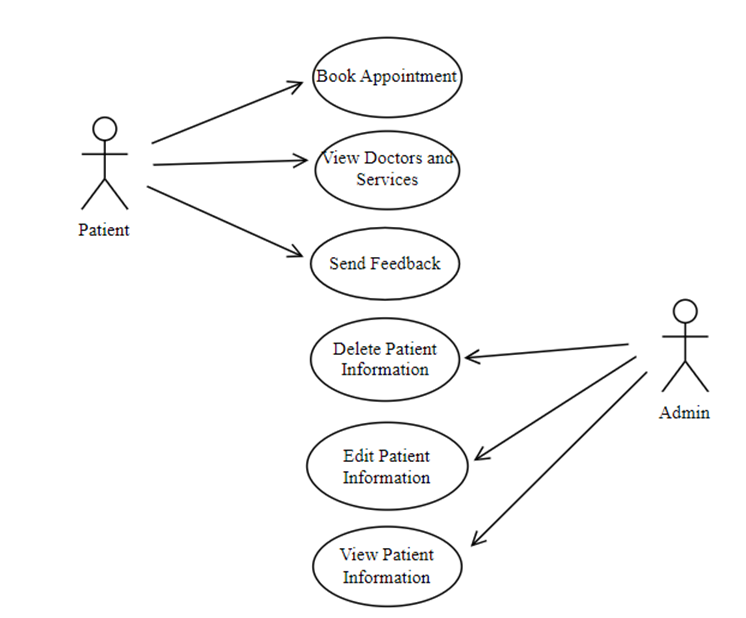
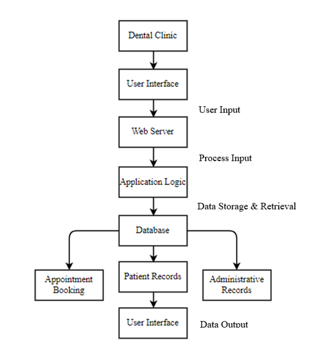
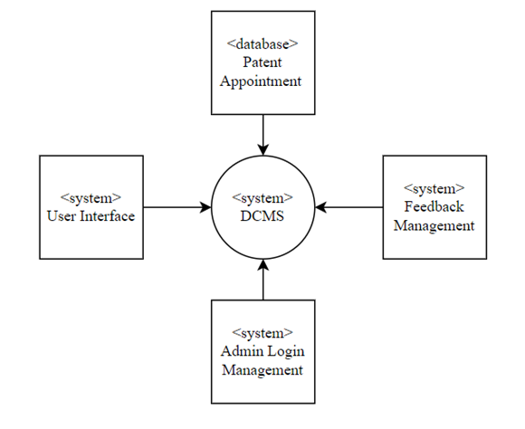
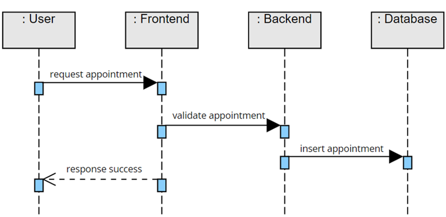
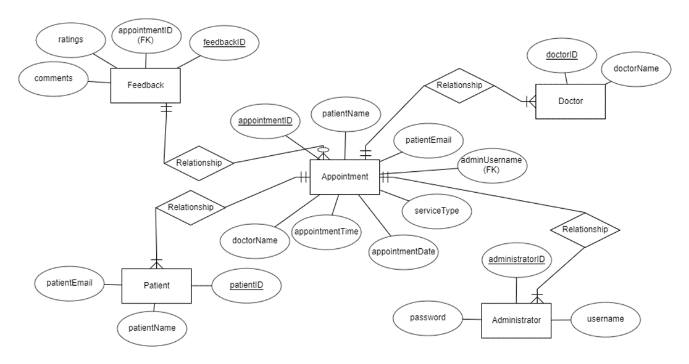
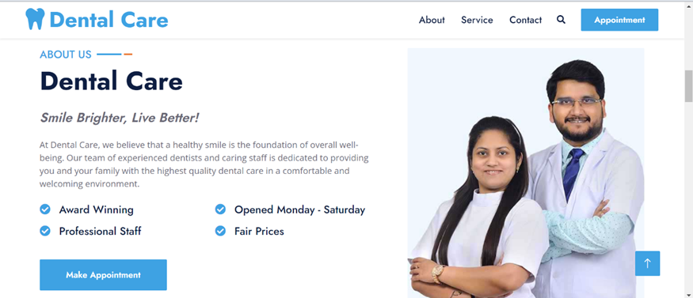
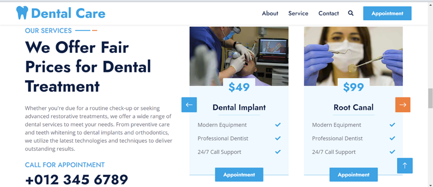
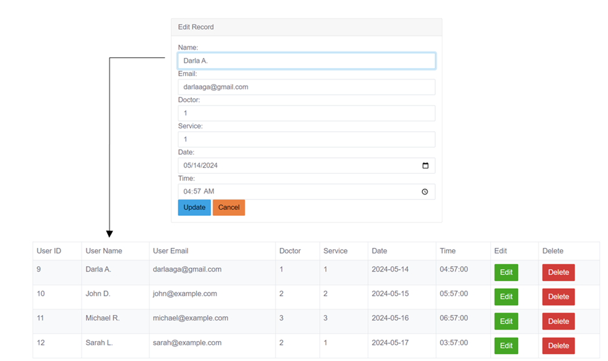
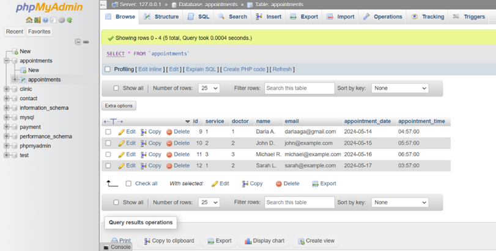

# CREATING AND IMPLEMENTING A DENTAL CLINIC SOFTWARE SYSTEM (DCSS)

# Introduction
The Project that aims to create a comprehensive web-based program that gives users a seamless way to access dental services while also giving clinic employees effective management capabilities. 

The DCSS will incorporate interactive elements for appointment scheduling, service descriptions, and patient resources, utilizing HTML, CSS, JavaScript, and PHP to ensure a user-friendly experience on devices. Through the integration of these features, the website will function as an all-inclusive online portal that facilitates patients' convenient access to vital information. 

# Scope of Work

This web-based application's product scope includes a home page, doctors page, admin page, database management, appointment scheduling, and services page.

The website seeks to improve patient experience through the application of user-centric design concepts and web technology improvements. Weighing usability, security, and scalability first, the project is inspired by multiple local and foreign dental clinic websites, which will be listed below along with references to ensure that the software meets industry standards, including City Dental Clinic, Elite Dental in Albania, and also Dakota Dental, LA Dental in USA. Delivering a reliable and approachable solution that satisfies dental clinics' changing needs and complies with industry standards is the ultimate objective in this website project. 

# Objectives 

By offering an integrated platform for managing and supervising customer data, providing information about doctors and services, and developing a specific website for administrators, the DCSS project software seeks to increase client satisfaction and involvement. The program is made to be accessible from a laptop or tablet with an internet connection and has an admin page and home page that are simple to use.

# Product Perspective

A thorough website created to improve patient appointments and simplify dental clinic operations is the DCSS software. The website's purpose is to give patients a single location to access essential features including making appointments, looking through doctor’s profiles, submitting applications, and learning about clinic offerings.

# Product Functions

The software will include an online appointment scheduling system to streamline the process, reducing wait times and enhancing convenience for patients, comprehensive service information, which will provide detailed and accessible information about various dental services, doctors, treatments, and procedures offered by the clinic, a feedback page, where the clients can rate and write comments about the services offered, and finally security measures to protect patient data from unauthorized access.

# User Classes and Characteristics

The DCSS software is made to meet the requirements of various user types, each with unique requirements and traits. 
* The main users, who are patients, value an easy browsing experience and convenient access to appointment scheduling and informative resources. 
* Administrative staff members prioritize efficient tools for managing appointments and patient records, requiring streamlined workflows and system reliability. 
* Doctors, the healthcare professionals, rely on access to patient information to provide personalized care, while website visitors seek easily accessible information about services and facilities. 
* System administrators oversee the technical aspects of the application, requiring strong infrastructure and security measures to ensure smooth operation.

# Operating Environment
HTML:
* Provides organization and content.
* Used for pages like patient resources, appointment scheduling, service descriptions, and contact details.

CSS:
* Enhances visual display and styling.
* Modifies appearance of text, photos, buttons, etc.
* Establishes fonts, colors, layouts, spacing, and responsive design.

JavaScript:
* Enhances functionality for dynamic features and user interaction.
* Adds client-side capabilities (e.g., dropdown menus, appointment scheduling forms, slideshow galleries).

PHP:
* Facilitates MySQL database communication.
* Enables data transmission between website and database.
* Allows users to schedule appointments and administrators to view/modify details.

# User Requirements
The dental clinic website's user requirements comprise a number of essential features that respond to various audiences. Having these elements is essential to giving patients, staff members, medical professionals, and website visitors a smooth experience. To be exact, the website must include: 

Homepage
* Introduction to the website.
* Highlights and summary of clinic offerings.
* Navigation options for other sections.

Doctors page
* Photo about medical staff.
* Helps patients make informed decisions.

Services Page
* Information on the clinic's services.
* Includes pricing.

Appointment Page
* Patients can choose doctor, service, date, and time.
* Secure entry of contact details.
* Simplifies and quickens appointment booking.

Admin Page
* Secure access for administrative staff.
* Manage appointments.
* Ensures data security.

# Design and Implementation Constraints

There are various limitations that affect the way the dental clinic's website is designed and implemented. 
* First and foremost, regulatory compliance is critical. To protect patient data and privacy, compliance with healthcare laws published by the Ministry of Healthcare in Albania is required. 
* Strong security measures like encryption and access controls must be implemented in order to further prevent unauthorized access to sensitive data. 
* In order to handle future growth and increased user traffic without sacrificing performance and guarantee the smooth management of appointments, patient records, and user interactions, scalability is also essential. 
* Furthermore, to provide a consistent user experience across multiple platforms, such as PCs and tablets across different web browsers and devices is crucial.

# Assumptions and Dependencies

Assumptions:
* Patients should be able to make appointments through the web platform for scheduling appointments.
* Dental service information should be easily accessible and well organized.
* The administrator should be able to edit the appointment details on his designated webpage.
* The website ought to load rapidly and react to user inputs right away.
* Both patients and clinic employees should find the interface to be user-friendly and intuitive.
* Encryption and protection of data are necessary to guarantee patient privacy.
* There should be very little downtime and constant availability for visitors on the website.

Dependencies:
* The program will make use of external parts (like a database management system). 
* The web hosting service on which the software is hosted is a requirement for the software's accessibility.
* Employing debugging tools and testing frameworks to guarantee code quality and find & fix problems as they arise.

# Hardware Interfaces

Through the logical and physical characteristics classification of hardware interfaces, we are able to gain a deeper understanding of the interactions and underlying communication protocols that define how users engage with the website across various devices and environments. 

### Logical Characteristics:
* Device Types and Interactions: Desktop, laptop, and tablet users can engage with the website using a variety of device kinds. With the use of keyboards, touchscreens, or mouse clicks, users traverse the website. They can obtain information, make requests, and carry out activities by interacting with interface elements like buttons, links, and forms.
* User Interface and Navigation: To help visitors navigate between sections and pages, the website offers simple navigation elements including menus and navigation bars. Because interface elements are made to be flexible and responsive, they will remain usable in a variety of device sizes and screen orientations.
* Data handling and processing: To create dynamic content, the website handles user inputs, stores data in databases, and retrieves information. Forms provided by users, including those for appointments, are verified and handled safely. Best practices are followed throughout data interactions to ensure data confidentiality, integrity, and security vulnerability protection.
* Communication Protocols: For client-server communications, the website makes use of common communication protocols such as HTTP(S). This ensures dependable data interchange and a smooth user experience by enabling seamless data transmission between the user's device and the web server hosting the page.

### Physical Characteristics:
* Important hardware components, including CPUs, RAM, hard drives, input/output devices, and keyboards, touchscreens, mouse, and trackpads for input/output and storage, are present in the devices used to access this dental clinic website. Together, these components provide the necessary processing power, memory, storage capacity, and user interface.
* Users interact with the website using input devices such as keyboards, touchscreens, or mice, and receive output through displays. The website's design accommodates different input methods and ensures compatibility with various output devices to facilitate user interaction.

# System Requirements

* Current web browsers such as Microsoft Edge, Mozilla Firefox, Google Chrome, and Safari will work with the system, guaranteeing cross-platform compatibility.
* In order to adjust its layout and design to different screen sizes and resolutions on desktop computers, laptops, tablets, and smartphones, the system must be responsive.
* The system will safely keep user data in a database, protecting sensitive data like personal information with access limits and encryption.
* Patients will be able to easily schedule appointments with the system by choosing their preferred doctors, services, days, and times, and submitting requests online. 
* To ensure smooth clinic operations, the system will offer administrative features for scheduling appointments, and updating patient information.
* To store and retrieve user, contact, and product sales data, the system will interface with databases like MySQL. 
* The system will have a user interface that follows design guidelines and GUI standards and is both responsive and simple to use.
* The system will be expandable to add more users and features as well as adapt to shifting business requirements. 

# Software Interfaces

Several software applications are connected with the dental clinic's website to ensure optimal functionality and a seamless user experience. This integration involves database interactions to manage data effectively. Through interactions with a MySQL database, the website saves and retrieves patient information, appointment calendars, and administrative data. The goal of these exchanges is to facilitate the safe and efficient retrieval and storage of data, all of which are essential for clinic operations. Because of the website's database integration, users can be sure they always have access to up-to-date information, which helps them make educated decisions and streamlines clinic operations.  

# Software Connections

In order to link the database and the webpage for this project, HTML and PHP will be used to develop the DCSS software according to the following criteria:

* Website Structure: PHP and HTML will be used in the creation of the software's user interface to offer the webpages' structure and layout. 

* Data processing: MySQL and PHP, will be used to manage the software's dynamic features. They are in charge of handling user input processing, establishing a connection to the database, and carrying out any required database activities.

* Database Connectivity: Using MySQL and the required credentials (password and username) for the admin's page, PHP will connect to the system's database. PHP will be able to communicate with the database using this connection and carry out operations like obtaining and inserting data.

# Other Nonfunctional Requirements
* The website must be quick to load and responsive, with optimum page load times for varying device types and internet connection speeds. Response times for user actions, including submitting feedback forms and scheduling appointments, should be minimized to guarantee an ideal user experience.
* The website will be designed to accommodate increasing user traffic and data quantities over time without compromising functionality.
* The website will abide by industry-standard security protocols to safeguard user information and guarantee its availability, confidentiality, and integrity. 
* Software should have the flexibility to grow or shrink in accordance with the demands of the business, such as the addition of new features and functionalities. 

# System Features

### Log In

A safe login system will be included on the website's admin page to verify administrators' identities and provide access to administrative features. Administrators will receive a login form to complete, requiring their password and username. The username "admin" and password "admin" will be the default admin credentials. After submitting the login form, the website will check the entered credentials against the database's stored admin credentials. The system will authenticate the administrator and provide access to the admin dashboard if the username and password match the records. Administrators will be able to manage clinic operations, update records, and alter appointments in addition to making changes to patient information after logging in.

###	Appointment Booking

The website will have an Appointment Booking Page so that users can easily make appointments. They must enter their name, email address, chosen appointment time and date, service choice, and doctor. The website will verify the accuracy and completeness of the data entered when the appointment form is submitted. All obligatory areas, such as name, email address, and desired appointment details, must be filled out by users. Additionally, users will be able to choose their doctor for their appointment and pick the required service from a list of possibilities. Following submission of the appointment details, the system will process the request and record the data on the administrators page and in the MySQL database. 

###	Getting Feedback

The website will have an Appointment Booking Page so that users can easily make appointments. They must enter their name, email address, chosen appointment time and date, service choice, and doctor. The website will verify the accuracy and completeness of the data entered when the appointment form is submitted. All obligatory areas, such as name, email address, and desired appointment details, must be filled out by users. Additionally, users will be able to choose their doctor for their appointment and pick the required service from a list of possibilities.

# Performance Metrics

###	Patient Engagement

One of the most important components of the dental clinic management system is patient engagement, which is a crucial indicator of how involved and engaged patients are with the clinic's services and products. This measure considers a number of patient engagement factors, such as participation in feedback and appointment attendance. Features that facilitate easy appointment scheduling will be integrated into the dental clinic management system in order to improve patient engagement metrics. 

###	Feedback

Implementing a feedback feature enhances performance metrics by providing valuable insights into user experience. Users can rate their interactions and leave comments, allowing for a detailed assessment of service quality. Analyzing this feedback enables the project team to identify areas for improvement and make data-driven decisions, ultimately enhancing overall performance metrics and user satisfaction.

#	System Design Specification

###	Use Case Model

An overview of potential user interactions with the dental clinic software system is given by the use case model.

In this diagram:
* The user is able to do functions like Book Appointment, View Doctors & Services, and Send Feedback.
* The administrator is able to do functions like Delete patient information, Edit patient information, and View patient information.

### Data Flow Diagram

By detailing the processing of the data flow, the Data Flow Diagram (DFD) helps to map out the information of each operation.

In this diagram:
* The "User Interface" represents the interface through which users interact with the dental clinic website.
*	User input is received through the interface and sent to the web server.
*	The "Web Server" processes the user input and forwards it to the application logic.
*	The "Application Logic" processes the input, which may involve tasks such as appointment scheduling, data validation, or user authentication.
*	Processed data is then stored or retrieved from the database management system.
*	Finally, the processed data is sent back to the user interface for display to the user. 

# Context Model

The Context Model outlines the different systems or databases that are used to maintain and structure context data.

In this context model:
*	The "Dental Clinic Website" is the main system being represented.
*	External entities such as users interact with the system through the "User Interface."
*	The "Database Management System" manages the storage and organization of data used by the system.
*	The “Feedback Management System” manages the feedback that is given by the users.
*	The “Admin Login Management” manages the page the admin uses for controlling the patient information.

# Activity Diagram

The Activity Diagram represents the flow of activities and actions within a system or process.

* Start: The activity diagram begins with the start point, indicating the initiation of the process.
*	User requests appointment: This step represents the user's action of requesting an appointment.
*	Form Submission: After the user submits the appointment request, the system receives the form submission.
*	Validate Input: The system validates the input data provided by the user to ensure accuracy and completeness.
*	Check appointment availability: At this point, the system checks the availability of appointments using two possible options:
*	Appointment scheduled: If an appointment slot is available, the system proceeds to schedule the appointment, and the process ends.
*	Appointment not available: If no appointment slots are available, the system notifies the user about the unavailability and prompts them to choose another time or date.
*	End: The activity diagram concludes with the end point, signifying the completion of the process. 

#	UML Class Design

The DCSS class diagram shows all of the classes used in development along with their relationships.

In this class:
* The "Administrator" class represents administrators of the dental clinic website. It has attributes username and password to store the administrator's credentials.
*	The class includes methods to set and retrieve the administrator's username and password.
*	Additional methods include login (username: string, password: string): boolean to authenticate the administrator based on provided credentials, viewAppointments() to view appointments, editAppointment(appointmentID: int) to edit appointments, and deleteAppointment(appointmentID: int) to delete appointments.

# Sequence Diagram

The figure depicts the interactions between components within DCSS in a chronological sequence.

In this class:
*	User initiates the process by requesting an appointment.
*	The request is sent to the Frontend component.
*	The Frontend component validates the appointment request.
*	After validation, the request is forwarded to the Backend.
*	The Backend component inserts the appointment into the system.
*	The Backend component communicates with the Database to store the appointment data.
*	Upon successful insertion, a response indicating success is sent back to the Frontend.
*	The Frontend receives the success response from the Backend.
*	Finally, the success response is relayed back to the User.

# Entity Relationship Diagram

The ERD of the DCSS database is depicted in the figure below, together with cardinality and relationship data, along with the characteristics of its tables. 

In this ERD:
*	Each table represents a different entity in the dental clinic website.
*	The "Appointment" table stores information about appointments made by patients, including appointment ID, patient name, appointment date, time, service type, and doctor name.
*	The "Patient" table stores information about patients, including patient ID, name, email, and phone number.
*	The "Doctor" table stores information about doctors, including doctor ID, name, and specialty.
*	The "Administrator" table stores information about administrators, including username and password.
*	The "Feedback" table includes attributes such as feedbackID (primary key), appointmentID (foreign key), rating, and comments.

The cardinality and relationship information between these tables:
*	An appointment is made by one patient (1 Patient) and is assigned to one doctor (1 Doctor).
*	A patient can have multiple appointments (1 Patient to many Appointments).
*	A doctor can have multiple appointments (1 Doctor to many Appointments).
*	An administrator manages the entire system and is not directly related to appointments, patients, or doctors.
*	Feedback is provided for one appointment (1 Appointment) and is associated with one feedback entry (1 Feedback).
*	An appointment can have multiple feedback entries (1 Appointment to many Feedback entries). 

# External Interface
When you use the DCSS software as a patient for the first time, the default view is displayed on the index.php page.

The name of the dental clinic is shown clearly along with the contact information and operating hours as soon as users open the website. The site's design, which is dominated by blue and white tones that stand for professionalism and cleanliness, creates an inviting and hygienic atmosphere. Visitors are welcomed to explore the dedication to offering the highest level of dental care, accompanied by an attention-grabbing headline that reads, "Take the Best Quality Dental Treatment."

The default view of the website contains the first part where the opening hours and best services are displayed, also the contact details, including a phone number (+012 345 6789) and email (dentalcare@gmail.com).

The next part of the website showcases a simple part of “About Us” content, where the users read the clinic’s slogan “Smile Brighter, Live Better!” and a few informative words about the clinic.

The most important part of the website is Appointment. The user finds himself in the appointment page, where he could put his information, including his name, email, and the desired service, doctor, time and date.

The next part of the home page is Pricing. Here, the user can take a look at the prices of the best services at the clinic, by pressing one of the buttons on the side to move the figures.

The website showcases a special offer on this part, where, if the user decides to book an appointment, as a first-time client he can save up to 30% on his checkup.

In the last part of the website, the user is able to send a message as desired to the clinic, by writing down his name, email, subject and message. The location, email, and phone number are also added in this part. Additionally, below he can take a look at the feedback that is given from other clients, in a rotating manner. 

When you use the DCSS program as an administrator for the first time, the logged-in view is displayed on the login.php page.

Here, the admin is required to put the correct username and password, in order to continue. For simplicity, both the username and password are “admin”.

After the administrator is logged in, he could either just take a look at the patient’s information, or edit / delete them. It is displayed the name, email, doctor, service and time for the admin.

In the example provided below, we are changing the name of the contact, from “Darla Aga”, to “Darla A.”.

# Database
PHPMyAdmin provides a user-friendly interface for managing many parts of database management when administering a database. Sensitive patient data, including contact information, must be handled securely in a clinic setting. 

Clinic administrators only have limited access to this data in order to protect patient privacy and confidentiality. For this reason, the separate login system with the 'login.php' page is put into place, as we previously discussed. Authorized staff can view patient contact information securely using this page, which serves as a secure gateway that prevents access to the information through PHPMyAdmin. 

By using this strategy, the clinic may reduce the possibility of unwanted access by strictly limiting who has access to important information. Additionally, by taking this precaution, the security of patient data is maintained while PHPMyAdmin continues to be an adaptable tool for managing many areas of the database, including information relevant to other businesses. 

# Software Testing

I have selected the Appointment class found in the appointments.php file as the testing component. The functionality for scheduling appointments in the dental clinic system is contained in this class. It is essential that this component is tested for the following reasons:

* Role: Appointment data editing, deletion, and retrieval from the database are managed by the Appointment class. Since appointments are a fundamental component of the DCSS, their accuracy is essential to the system's general operation.
* Effect on the Structure: Inadequate appointment management may result in lost data, difficulties with scheduling, or problems with patient care. As a result, careful testing of this part can guard against problems like these and guarantee system dependability.

### Error Codes & Descriptions

E001	Connection to the database failed.

E002	Failed to create appointment: Invalid input data.

E003	Failed to edit appointment: Appointment not found.

E004	Failed to delete appointment: Appointment not found.

E005	Failed to retrieve appointments: Database query error.

* E001: Indicates that the connection to the database failed, most likely due to incorrect credentials or server issues.

* E002: Indicates that the creation of an appointment failed due to invalid input data, such as missing required fields or incorrect data formats.

* E003: Indicates that the attempt to edit an appointment failed because the specified appointment ID was not found in the database. 

* E004: Indicates that the attempt to delete an appointment failed because the specified appointment ID was not found in the database.

* E005: Indicates a general failure to retrieve appointments from the database, likely due to a database query error or connection issue.
